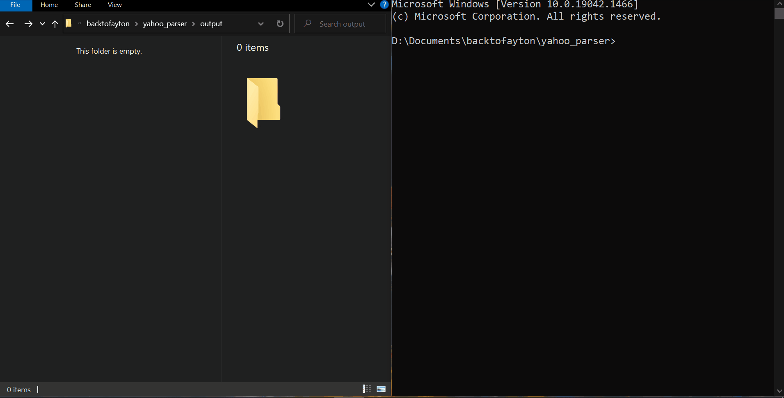

# Financial data parser from Yahoo
Retrieve historical data of a given ticker list for a given time period from finance.yahoo.com.

## Built With

- Python

## Getting Started

Stage 1. Find the company page on the website. Through a search on the site or in any other way.

Stage 2. On the company page, go to the tab with historical data.

Stage 3. Select data for the maximum period.

Stage 4. Download data using the link “Download Data”

Stage 5. Save data from file to database.

List of companies for testing:
PD
AAPL
ZUO
PINS
ZM
DOCU
CLDR
RUN

Important note: everything should be automatic.
An implementation is encouraged where CSV files are not saved locally during scraping.

Stage 6. You need to create a REST API service that will start scraping and return JSON with saved data for any company specified by the user.

Stage 7. It will be a plus to use Docker and / or docker-compose.

The task is to implement without using Selenium.
Requests must be used.

It is necessary to implement the project using the principles of SOLID and OOP.

https://query1.finance.yahoo.com/v7/finance/download/AAPL?period1=347155200&period2=1634515200&interval=1d&events=history&includeAdjustedClose=true

## Authors

👤 **damdafayton**

- [Github](https://github.com/damdafayton)
- [LinkedIn](https://linkedin.com/in/damdafayton)

## 🤝 Contributing

Contributions, issues, and feature requests are welcome!

Feel free to check the [issues page](../../issues/).

## Show your support

Give a ⭐️ if you like this project!

## 📝 License

This project is [MIT](./MIT.md) licensed.
